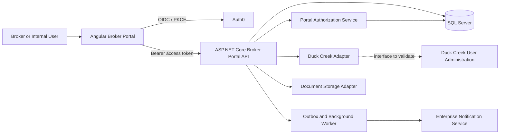
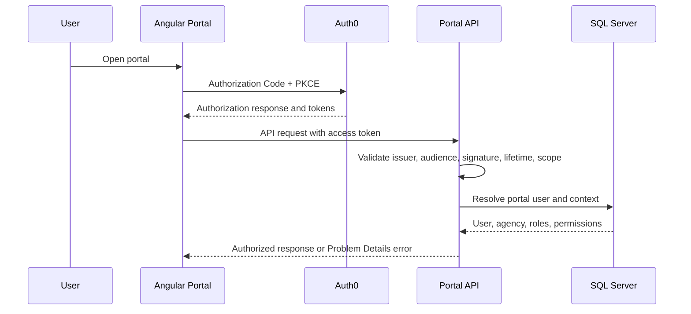
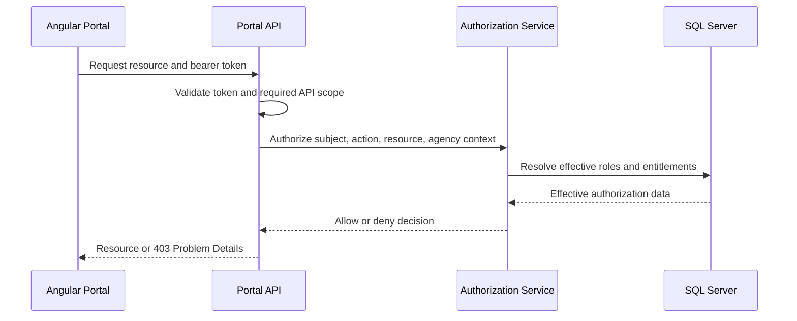
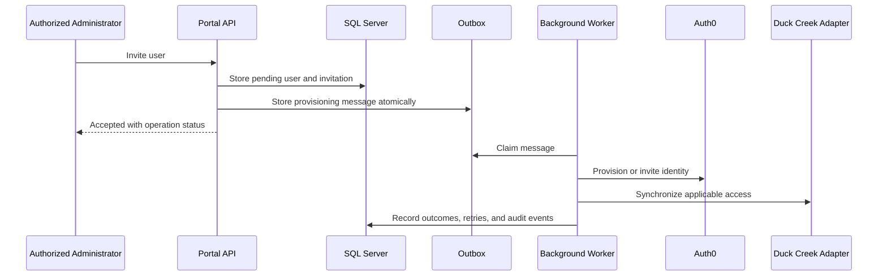
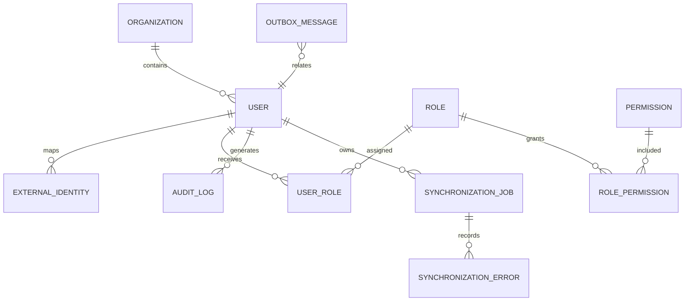

# Broker Portal Project Initiation Package

**Status:** Draft for architecture, security, product, and delivery review  
**Date:** 2026-09-22  
**Classification:** Working design; no external system capability is confirmed by this repository

## 1. Executive Summary

The Broker Portal will provide secure self-service capabilities for commercial insurance brokers and internal users across dashboard, user administration, underwriting guidelines, small commercial submissions, notifications, reporting, administration, and support. The design must remain extensible for Duck Creek Policy, Billing, Rating, Producer, document, notification, and enterprise services.

The recommended starting point is a modular monolith: an Angular application, an ASP.NET Core API, SQL Server persistence, background processing, and explicit integration ports. Auth0 is the authentication authority. The API owns application authorization decisions and uses controlled adapters to synchronize or query Duck Creek capabilities after the actual interface is confirmed. This minimizes early operational complexity while preserving clear boundaries for later extraction.

## 2. Confirmed Scope

The following are confirmed by the supplied master prompt:

1. Angular and TypeScript frontend.
2. ASP.NET Core and C# backend.
3. SQL Server with Entity Framework Core.
4. Auth0 using OAuth 2.0 and OpenID Connect with Authorization Code Flow and PKCE.
5. JWT bearer protection for backend APIs.
6. Role- and entitlement-aware authorization enforced by the backend.
7. Future integration with Duck Creek and enterprise services.
8. Responsive, accessible, observable, testable, and deployable enterprise software.
9. Phased delivery using two-week sprints and a planning horizon of approximately twelve months, subject to validation.

## 3. Working Assumptions

| ID | Assumption | Validation owner | State |
|---|---|---|---|
| A-001 | The portal can begin as a modular monolith. | Principal Architect | Proposed |
| A-002 | Auth0 can issue an API audience and scopes approved by IAM governance. | IAM Architect | Unvalidated |
| A-003 | SQL Server is available as the transactional store. | Data Architect | Unvalidated |
| A-004 | A queue or equivalent durable background mechanism is available. | Platform Architect | Unvalidated |
| A-005 | The initial release can use mock Duck Creek adapters. | Product Owner and Duck Creek Architect | Proposed |
| A-006 | Twelve months is a planning assumption, not a committed date. | Product Owner and Delivery Manager | Proposed |

## 4. Open Questions and Architecture Decision Log

| ID | Classification | Question or decision | Impact |
|---|---|---|---|
| OQ-001 | Open question | Which Angular and .NET versions are organization-approved? | Blocks reproducible scaffolding |
| OQ-002 | Open question | Which Duck Creek products, environments, APIs, contracts, authentication methods, and rate limits are available? | Blocks real adapters and contract tests |
| OQ-003 | Open question | Is Duck Creek the source of truth for any portal role or entitlement? | Controls authorization design |
| OQ-004 | Open question | Which Auth0 tenant, federation, MFA, logout, timeout, and session policies apply? | Controls IAM configuration |
| OQ-005 | Architecture decision required | Azure DevOps or GitHub Enterprise for CI/CD? | Controls pipeline implementation |
| OQ-006 | Architecture decision required | Object storage, enterprise content management, or SQL Server for documents? | Controls document architecture and cost |
| OQ-007 | Architecture decision required | Approved hosting, observability, secret-management, and messaging platforms? | Blocks deployment assets |
| OQ-008 | Dependency | Local SDKs and database tooling are not installed on the current machine. | Blocks compilation and executable tests |
| R-001 | Risk | Authorization synchronization may be stale or unavailable. | Possible access inconsistency |
| R-002 | Risk | External Duck Creek capability is unknown. | Integration schedule and scope risk |
| R-003 | Risk | Unapproved non-functional targets could become accidental commitments. | Delivery and performance risk |

## 5. Recommended Target Architecture

### Recommendation

Use a modular monolith with these deployable units:

- Angular portal web application.
- ASP.NET Core API with API, application, domain, infrastructure, persistence, security, and integration modules.
- Background worker for outbox delivery, synchronization, reconciliation, and notifications.
- SQL Server for transactional portal data and audit metadata.
- Approved object/document service for large files after the document-storage ADR.
- Auth0 for authentication and identity lifecycle events.
- Integration ports for Duck Creek and other enterprise services, with mocks until contracts are approved.

### Security boundary

The browser is an untrusted client. Angular route guards only improve usability. Every API operation validates the JWT and applies a deny-by-default policy using the authenticated subject, portal user, broker/agency context, roles, permissions, entitlements, and resource ownership rules. Sensitive authorization decisions are not trusted solely from browser state or long-lived tokens.

### Integration pattern

Use ports and adapters such as `IUserAdministrationGateway`, `IAuthorizationProvider`, `IPolicyGateway`, `IBillingGateway`, `IRatingGateway`, `IDocumentStorageProvider`, `INotificationProvider`, and `IAuditPublisher`. Use an outbox and retryable background processing for cross-system work. Avoid distributed transactions across Auth0, Duck Creek, and SQL Server.

### Alternatives considered

| Option | Strength | Main drawback | Recommendation |
|---|---|---|---|
| Modular monolith | Lowest operational complexity; strong delivery speed; clear future boundaries | Requires module discipline | **Preferred initial model** |
| Microservices from day one | Independent scaling and deployment | Higher platform, testing, data, and support complexity | Defer until measured need |
| Auth0-only authorization | Centralized identity experience | Does not express all agency, resource, product, or Duck Creek rules well | Not sufficient alone |
| Duck Creek-only authorization | Aligns with Duck Creek permissions | Creates coupling and availability/synchronization risk | Validate for applicable entitlements |
| Hybrid local authorization | Fast enforcement and portal-specific rules | Requires synchronization and reconciliation | **Preferred target, pending source-of-truth decision** |

## 6. System Context



**Purpose:** establish the trust and dependency boundaries.  
**Security:** Auth0 authenticates; the API validates tokens and enforces authorization.  
**Failure scenarios:** Auth0, SQL Server, Duck Creek, document storage, or notification outages must produce bounded failures, operational telemetry, and retry/compensation behavior where appropriate.  
**Unconfirmed dependencies:** all Duck Creek interfaces, notification service contracts, document platform, hosting, and observability platform.

## 7. Authentication Sequence



**Decision required:** token storage, refresh rotation, idle/absolute timeouts, forced logout, revocation, concurrent sessions, and behavior during authorization dependency outages.

## 8. Authorization Sequence



## 9. User Provisioning Sequence



**Failure handling:** retries must be idempotent; failed work is visible in synchronization status; reconciliation detects orphaned identities; compensating actions are preferred over distributed transactions.

## 10. Source-of-Truth Matrix

| Data | Candidate authority | Portal responsibility | Decision state |
|---|---|---|---|
| Authentication identity and credentials | Auth0 | Map external identity; never store passwords | Confirmed direction |
| Auth0 user identifier | Auth0 | Store immutable mapping | Confirmed direction |
| User profile | Portal or enterprise MDM | Store only required portal attributes | Open |
| Broker, agency, organization | Portal or enterprise master data | Maintain validated relationships | Open |
| Portal roles and permissions | Portal | Enforce effective policies | Recommended |
| Duck Creek roles and entitlements | Duck Creek if applicable | Map and reconcile through adapter | Open |
| MFA status | Auth0 | Consume approved status/events if needed | Open |
| Account status | Auth0 plus portal lifecycle | Enforce both authorities consistently | Open |
| Session status | Auth0/browser/API policy | Record minimal operational metadata | Open |
| Audit history | Portal audit platform | Immutable, privacy-safe audit trail | Recommended |
| Synchronization status | Portal | Track attempts, errors, retries, and reconciliation | Recommended |

## 11. Module Breakdown

1. Platform foundation and shared contracts.
2. Authentication and authorization.
3. User management and lifecycle orchestration.
4. Underwriting guidelines and document metadata.
5. Small commercial submission and status tracking.
6. Notifications and reporting.
7. Administration, audit, and support operations.
8. Duck Creek and enterprise integration adapters.
9. Observability, background processing, and operational tooling.

## 12. Data Model Direction

The first persistence slice should establish `User`, `ExternalIdentity`, `Organization`, `Role`, `Permission`, `UserRole`, `UserEntitlement`, `SynchronizationJob`, `SynchronizationError`, `AuditLog`, and `OutboxMessage`. Guideline, submission, document, notification, and reporting tables follow their module discovery. Use immutable external identifiers, explicit tenant/agency boundaries, optimistic concurrency, UTC timestamps, audit metadata, and data-classification annotations.



## 13. API Catalog for First Increment

| Method | Route | Purpose | Authorization |
|---|---|---|---|
| GET | `/health` | Liveness/readiness baseline | Public or platform-restricted by deployment policy |
| GET | `/api/v1/users` | Search users contract | `users:read` |
| GET | `/api/v1/users/{id}` | Retrieve user contract | `users:read` plus agency/resource policy |
| POST | `/api/v1/users/invitations` | Create invitation contract | `users:create` |
| GET | `/api/v1/users/{id}/authorization` | Retrieve effective access | `users:read` plus subject/resource policy |
| GET | `/api/v1/users/{id}/synchronization` | Retrieve sync status | `users:read` plus support policy |

All non-health endpoints should use versioned routes, Problem Details errors, correlation IDs, bounded pagination, validation, audit events, and no stack traces or secrets in responses.

## 14. Security Architecture

Priority threats include account takeover, token theft, broken access control, privilege escalation, IDOR, injection, XSS, malicious uploads, secret leakage, excessive logging, API abuse, replay, dependency compromise, authorization staleness, and external integration failure.

Initial controls:

- Validate issuer, audience, signature, expiry, and scopes on every protected API request.
- Apply deny-by-default policies and server-side agency/resource checks.
- Use PKCE, secure session policy, CSP, secure headers, strict CORS, TLS, and dependency/secret scanning.
- Use parameterized data access and validated file type, size, content, and malware scanning before persistence.
- Do not log tokens, credentials, secrets, full documents, or unnecessary PII.
- Emit privacy-safe security and audit events with correlation IDs.
- Rate-limit authentication-sensitive and mutation endpoints.
- Maintain reconciliation and emergency access-revocation procedures.

## 15. Proposed Non-Functional Requirements

These are proposed targets for approval, not commitments:

| ID | Target | Approval role |
|---|---|---|
| NFR-001 | 99.9% monthly availability for the production portal | Product Owner and SRE |
| NFR-002 | p95 read API latency below 500 ms excluding external dependencies | Product Owner and Performance Lead |
| NFR-003 | WCAG 2.2 AA for supported user journeys | Product Owner and Accessibility Lead |
| NFR-004 | RTO and RPO defined per data classification before UAT | Business Owner and DR Lead |
| NFR-005 | Zero critical/high unresolved security findings at release approval | Security Lead |
| NFR-006 | Supported browser matrix approved before development completion | Product Owner and Architecture |

## 16. Delivery Phases and Milestones

| Phase | Outcome | Gate |
|---|---|---|
| 0. Discovery and Mobilization | Scope, stakeholders, dependencies, baseline decisions | Charter approval |
| 1. Architecture and Foundation | Repo, architecture, security baseline, CI/CD direction | Architecture/security review |
| 2. Identity and User Management | Auth0 integration structure, users, roles, audit | IAM and product acceptance |
| 3. Underwriting Guidelines | Search, versions, approval, publication design | Content and compliance acceptance |
| 4. Small Commercial MVP | Draft, validation, submit, status workflow | MVP/UAT entry |
| 5. Integration Hardening | Contract tests, retries, reconciliation, performance | Integration readiness |
| 6. UAT and Operational Readiness | Traceability, runbooks, DR, support readiness | Go-live decision |
| 7. Production Launch | Controlled deployment and smoke validation | Production approval |
| 8. Hypercare and Transition | Stabilization and support ownership transfer | Operational acceptance |

## 17. Initial Work Breakdown Structure

1. Governance: charter, RAID, decision log, status, approvals.
2. Discovery: personas, workflows, source-of-truth, Duck Creek and Auth0 validation.
3. Architecture: context, data, API, security, integration, deployment, ADRs.
4. Foundation: repository, Angular shell, API shell, persistence, health, telemetry, CI.
5. Product modules: user management, guidelines, submissions, notifications, reports.
6. Quality: unit, integration, contract, E2E, accessibility, security, performance, DR.
7. Release: infrastructure, configuration, migrations, approvals, rollback, smoke tests.
8. Operations: monitoring, runbooks, training, support transition, hypercare.

## 18. First Implementation Increment

### Proposed files

```text
/src/portal-web
/src/portal-api
/src/application
/src/domain
/src/infrastructure
/src/integrations
/src/background-jobs
/tests/unit
/tests/integration
/tests/contract
/deployment/pipelines
/deployment/configuration
/docs/api
/docs/security
```

### Increment scope

1. Scaffold Angular application shell and route boundaries.
2. Scaffold .NET API with health endpoint, OpenAPI, correlation middleware, exception handling, and JWT validation placeholders.
3. Add authorization policy abstractions and a deny-by-default baseline.
4. Add user domain contracts and persistence foundation.
5. Add Duck Creek gateway interface and mock adapter.
6. Add configuration examples with placeholders only.
7. Add unit/integration test projects and CI/security placeholders.
8. Document local setup once approved SDK versions are known.

### Current blockers

- Supported toolchain versions are not confirmed.
- The local machine lacks .NET SDK, Node/npm, Angular CLI, and Git.
- Auth0 tenant values and approved policies are unavailable.
- Duck Creek API contracts and environment connectivity are unavailable.
- Hosting, messaging, document, observability, and CI/CD platforms are undecided.

No source-code foundation should be claimed compilable until these prerequisites are resolved or a build-capable agent environment is provided.

## 19. Approval Points

Architecture, IAM, security, product, data, Duck Creek integration, platform, delivery, and operations owners should approve the target model, source-of-truth matrix, initial NFR targets, external integration assumptions, hosting/toolchain choices, and first implementation scope before production-oriented code is generated.